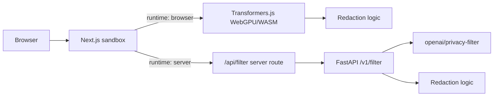

# OpenAI Privacy Filter API

[](https://github.com/shiftbloom-studio/openai-privacy-filter-api/actions/workflows/ci.yml)
[](LICENSE)

A small, inspectable FastAPI service and Next.js sandbox for running
[`openai/privacy-filter`](https://huggingface.co/openai/privacy-filter). It detects privacy-related
spans in text, applies configurable redaction, and exposes a minimal API that can be deployed behind
a server-side web proxy.

This project is intentionally narrow: it is a testable wrapper around a privacy-detection model, not
a production policy engine, classifier benchmark, or complete data governance system.

## Features

- FastAPI API with `/health` and `/v1/filter`.
- Next.js sandbox UI for testing sample text and inspecting detected spans.
- [`@shiftbloom-studio/privacy-filter`](packages/privacy-filter): the in-browser engine as a standalone npm
  package (Transformers.js, WebGPU/WASM) for reuse in other Next.js apps.
- Two runtimes behind one contract: in-browser (WebGPU/WASM) and server-side (FastAPI).
- Redaction modes: `mask`, `remove`, and `annotate`.
- Optional internal-token protection between the web proxy and API.
- Docker images for the API and web app.
- Consent gate before the ~900 MB in-browser model download.
- Vercel configuration for the no-compute browser-runtime deployment.
- AWS App Runner workflow, retained for self-hosters with inference compute.
- Unit tests for schemas, redaction, API behavior, Lambda adapter, web proxy, and UI behavior.
- Model files are kept outside source control and can be restored from deployment artifacts.

## Architecture

The sandbox supports two runtimes selected with `NEXT_PUBLIC_PRIVACY_FILTER_RUNTIME`:

- `browser` (default): the model runs in the visitor's browser through
  [Transformers.js](https://huggingface.co/docs/transformers.js), using WebGPU where available and
  falling back to WASM (CPU). The engine lives in the standalone
  [`@shiftbloom-studio/privacy-filter`](packages/privacy-filter) package. No inference compute is required
  and input text never leaves the device. Because the weights are about 900 MB, the sandbox asks for
  consent before downloading anything — nothing is fetched until the visitor agrees.
- `server`: the Next.js server route proxies to the Python FastAPI service.



Both runtimes share the same request and response contract and the same redaction semantics, so the
sandbox behaves identically either way.

The Shiftbloom deployment on Vercel (`privacy.shiftbloom.studio`) runs the `browser` runtime because
no server-side inference compute is provisioned. The API, Lambda, and Cloud Run paths remain fully
maintained for self-hosters — they are simply not deployed for Shiftbloom. See
[docs/deployment.md](docs/deployment.md).

In `server` mode the browser never calls the model API directly. The Next.js app proxies requests
through its server-side route, optionally adding `PRIVACY_FILTER_INTERNAL_TOKEN` so the API can
reject direct public traffic.

## Repository Layout

```text
apps/
  api/      FastAPI service, Lambda adapter, redaction logic, and tests
  web/      Next.js App Router sandbox, API proxy, and tests
packages/
  privacy-filter/  @shiftbloom-studio/privacy-filter — in-browser engine (npm package)
infra/
  docker/   API and web Dockerfiles
docs/       API contract and deployment notes
```

## The npm package

The in-browser engine is published to npm as
[`@shiftbloom-studio/privacy-filter`](packages/privacy-filter) from this repository (on GitHub Release, via
[publish-package.yml](.github/workflows/publish-package.yml)), so other Next.js (or any
bundler-based) apps can run the same model client-side:

```bash
npm install @shiftbloom-studio/privacy-filter
```

```tsx
"use client";

import { applyRedaction, detectSpansInBrowser } from "@shiftbloom-studio/privacy-filter";

const spans = await detectSpansInBrowser(text, { onProgress: setProgress });
const [filtered] = applyRedaction(text, spans, "mask", "[REDACTED]");
```

Detection is model-only (no regex/keyword heuristics), long text is chunked for the model's
257-token window, and the ~900 MB download starts only when you call the engine — gate it behind a
consent prompt. See the [package README](packages/privacy-filter/README.md) for the full API.

## Requirements

- Python 3.11 or newer
- Node.js 24 or newer
- npm
- Docker, optional but recommended for deployment parity
- AWS CLI, optional: only for the retained App Runner and Lambda paths. Not needed for the Vercel
  deployment or for local browser-runtime development.

The real model runtime requires `torch` and `transformers`. Unit tests do not download or load the
model unless the explicit real-model smoke test is enabled.

Running the sandbox in the browser requires no Python inference dependencies at all.

## Quick Start

Clone the repo and copy the example environment:

```bash
git clone https://github.com/shiftbloom-studio/openai-privacy-filter-api.git
cd openai-privacy-filter-api
cp .env.example .env
```

### Browser runtime (default, no inference compute)

Install web dependencies and start the sandbox:

```bash
npm install
npm --workspace apps/web run dev
```

Open `http://localhost:3000`. Before the first filter runs, the sandbox asks for consent and then
downloads the model weights — roughly 900 MB (~874 MB of `q4` ONNX weights plus a ~26 MB tokenizer)
— which the browser caches for later visits.

### Server runtime

Start the API without inference dependencies:

```bash
python3 -m venv .venv
source .venv/bin/activate
python -m pip install -e "apps/api[dev]"
uvicorn privacy_filter_api.main:app --app-dir apps/api/src --reload
```

Start the web sandbox in another shell:

```bash
npm install
NEXT_PUBLIC_PRIVACY_FILTER_RUNTIME=server \
  PRIVACY_FILTER_API_URL=http://localhost:8000 npm --workspace apps/web run dev
```

Open `http://localhost:3000`.

## Running the Real Model Locally

Install inference dependencies:

```bash
source .venv/bin/activate
python -m pip install -e "apps/api[dev,inference]"
```

Run the API with a Hugging Face cache directory:

```bash
HF_HOME=.hf-cache uvicorn privacy_filter_api.main:app --app-dir apps/api/src --reload
```

The first request that needs inference may download model files. To run the smoke test explicitly:

```bash
RUN_REAL_MODEL_TESTS=1 python -m pytest apps/api/tests/test_real_model_smoke.py
```

## API Usage

Health check:

```bash
curl http://localhost:8000/health
```

Filter text:

```bash
curl -X POST http://localhost:8000/v1/filter \
  -H "content-type: application/json" \
  -d '{
    "text": "My name is Alice Smith and my email is alice@example.com.",
    "mode": "mask",
    "mask_token": "[REDACTED]",
    "include_spans": true
  }'
```

Example response:

```json
{
  "original_text": "My name is Alice Smith and my email is alice@example.com.",
  "filtered_text": "My name is [REDACTED] and my email is [REDACTED].",
  "spans": [
    {
      "label": "private_person",
      "start": 11,
      "end": 22,
      "text": "Alice Smith",
      "score": 0.97
    }
  ],
  "model": "openai/privacy-filter"
}
```

Supported labels:

- `account_number`
- `private_address`
- `private_email`
- `private_person`
- `private_phone`
- `private_url`
- `private_date`
- `secret`

Supported modes:

- `mask`: replace each accepted span with `mask_token`.
- `remove`: remove each accepted span.
- `annotate`: replace each accepted span with `[label:value]`.

See [docs/api.md](docs/api.md) for the API contract.

## Configuration

| Variable | Used by | Default | Description |
| --- | --- | --- | --- |
| `PRIVACY_FILTER_MODEL_ID` | API | `openai/privacy-filter` | Hugging Face model id reported by the service and used when no model path is set. |
| `PRIVACY_FILTER_MODEL_PATH` | API | empty | Local model directory. Use this for baked or mounted model files. |
| `PRIVACY_FILTER_RUNTIME` | API | `local` | Runtime label returned by `/health`. |
| `PRIVACY_FILTER_CORS_ORIGINS` | API | `http://localhost:3000,https://privacy.shiftbloom.studio` | Comma-separated CORS allowlist. |
| `PRIVACY_FILTER_INTERNAL_TOKEN` | API and web | empty | Optional shared token. The web proxy sends it to the API. |
| `PRIVACY_FILTER_DEVICE` | API | empty | Optional Transformers device setting. |
| `PRIVACY_FILTER_REVISION` | API | empty | Optional Hugging Face model revision. |
| `PRIVACY_FILTER_TRUST_REMOTE_CODE` | API | `false` | Enables remote model code if a future revision requires it. |
| `HF_HOME` | API | `.hf-cache` locally | Hugging Face cache directory. |
| `PRIVACY_FILTER_API_URL` | web | `http://localhost:8000` | API base URL used by the Next.js server-side proxy. Only used in `server` runtime. |
| `NEXT_PUBLIC_PRIVACY_FILTER_RUNTIME` | web | `browser` | `browser` runs the model in-browser (WebGPU/WASM). `server` proxies to the FastAPI service. |

## Verification

API:

```bash
source .venv/bin/activate
python -m ruff check apps/api
python -m pytest apps/api
```

Web and package (root scripts cover both `apps/web` and `packages/privacy-filter`):

```bash
npm run lint
npm run typecheck
npm test
npm run build
```

Optional real-model smoke test for the browser engine (downloads the actual ~900 MB weights once,
then uses the local Hugging Face cache):

```bash
npm run verify:model
```

Docker smoke build:

```bash
docker build -f infra/docker/api.Dockerfile --build-arg API_EXTRAS= -t privacy-filter-api:core .
docker build -f infra/docker/web.Dockerfile -t privacy-filter-web .
```

## Docker

Run both services locally with Docker Compose:

```bash
docker compose up --build
```

Build the API image:

```bash
docker build -f infra/docker/api.Dockerfile -t privacy-filter-api .
```

Build the web image:

```bash
docker build -f infra/docker/web.Dockerfile -t privacy-filter-web .
```

The API Dockerfile copies `privacy-filter-model/` into `/models/privacy-filter`. For production
offline inference, place the required model files there before building and set
`PRIVACY_FILTER_MODEL_PATH=/models/privacy-filter`.

Required model files:

- `config.json`
- `model.safetensors`
- `tokenizer.json`
- `tokenizer_config.json`
- `viterbi_calibration.json`

Do not commit model files to the repository.

## Deployment

The project can run anywhere that supports Docker containers. The included deployment notes cover
Vercel, Docker, AWS Lambda container images, Google Cloud Run, Cloudflare routing, and the AWS App
Runner setup that remains available to self-hosters. See [docs/deployment.md](docs/deployment.md).

### Shiftbloom deployment (Vercel)

`privacy.shiftbloom.studio` is deployed on **Vercel** and runs the **`browser` runtime**: the model
executes in the visitor's browser, so no server-side inference compute is required or provisioned.

The repository ships a [vercel.json](vercel.json) for this setup. Configure the Vercel project with:

| Setting | Value |
| --- | --- |
| Root Directory | `apps/web` |
| Framework Preset | Next.js |
| Build Command | `cd ../.. && npm run build` |
| Install Command | `cd ../.. && npm install` |
| Output Directory | `.next` |

`NEXT_PUBLIC_PRIVACY_FILTER_RUNTIME` is pinned to `browser` in `vercel.json`, so no environment
variable is strictly required. It is inlined at build time, so changing it needs a redeploy rather
than a restart.

Because the weights are roughly 900 MB, the sandbox asks for consent before downloading anything.
Nothing is fetched on page load.

### AWS App Runner (available to self-hosters)

The repository also includes a GitHub Actions workflow for App Runner, retained for operators who
have provisioned inference compute. It is **not** part of the Shiftbloom deployment and is currently
disabled:

- API App Runner service: `privacy-filter-api`
- Web App Runner service: `privacy-filter-web`
- AWS region: `eu-central-1`
- ECR repositories: `privacy-filter-api`, `privacy-filter-web`
- Model artifact bucket: `shiftbloom-privacy-filter-build-349744179866-eu-central-1`

On pushes to `main`, [deploy-aws.yml](.github/workflows/deploy-aws.yml) detects changed paths and
deploys only the affected surface. It can also be run manually with `all`, `api`, `web`, or `auto`.

Forks should replace the AWS account id, service ARNs, ECR repositories, artifact bucket, and OIDC
role with their own infrastructure.

## Security and Privacy Notes

- Treat model output as advisory. Validate behavior against your data and policy requirements.
- Do not send sensitive production data to infrastructure you do not control.
- Use `PRIVACY_FILTER_INTERNAL_TOKEN` when the API is reachable outside a private network.
- Keep CORS origins narrow in production.
- Keep model files, caches, credentials, and deployment artifacts out of source control.
- Review upstream model terms and dependencies before production use.

## Contributing

Contributions are welcome. Keep changes focused and include tests for behavior changes.

Suggested flow:

1. Open an issue or draft PR for larger changes.
2. Run the relevant verification commands locally.
3. Keep API contract changes documented in [docs/api.md](docs/api.md).
4. Keep deployment changes documented in [docs/deployment.md](docs/deployment.md).

Please avoid committing generated model files, local caches, credentials, or machine-specific build
artifacts.

## License

Apache License 2.0. See [LICENSE](LICENSE).

## Acknowledgements

This project wraps [`openai/privacy-filter`](https://huggingface.co/openai/privacy-filter) through
standard Python and web application tooling. Model behavior, supported labels, and runtime
requirements may change with upstream model revisions.
